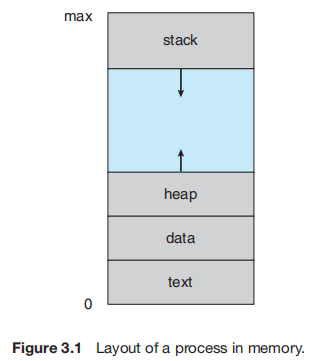

## Process

> A process is a program in execution.

#### **进程内存分布：**

* **Text Section 代码段** - 可执行代码

* **Data Section 数据段** - 全局变量，静态变量

* **Heap Section 扩展段（堆）** - 程序运行时动态申请的内存

* **Stack Section 运行时段（栈）** - 调用函数时，暂时的数据存储（函数参数、返回地址、局部变量）

#### **进程（process）和线程（thread）的区别：**

* 基本单位

    进程是对运行时程序的封装，是系统进行资源分配和调度的基本单位；线程是进程的子任务，是CPU调度和分派的基本单位；

    一个程序至少有一个进程，一个进程至少有一个线程；

* 资源分配
    
    进程在执行过程中拥有独立的内存单元（地址空间）；多个线程共享进程的内存；

    资源分配给进程；统一进程的多个线程共享**代码段、数据段、扩展段**，但每个线程拥有自己的**运行时段**（用于存储局部变量、临时变量）（见[进程内存分布](#进程内存分布)）

* 通信方式

    一个进程的多个线程之间可以通过传递地址/全局变量/静态变量的方式传递信息（不过需要处理好同步和互斥，见[线程同步](#线程同步)；而进程之间只能通过[进程间通信](#进程间通信)的方式进行；

* 开销大小

    对进程操作一般开销较大，进程**上下文切换**比线程上下文切换开销大，因为
        
    1. 需要记录进程状态（包括内存指针）和CPU寄存器的值；
        
    2. 需要切换虚拟内存空间，页目录、页表缓冲、寄存器都需要切换，在一段时间内导致内存访问比较低效（冷启动）；
    但线程切换过程中不会出现这个问题；

#### **进程间通信**

1. **管道** 管道是单向的、先进先出的、无结构的、固定大小的字节流，它把一个进程的标准输出和另一个进程的标准输入连接在一起。只能承载无格式字节流、缓冲区大小受限。分为无名管道和有名管道。

2. **消息队列** 一个在系统内核中用来保存消息的队列，以消息链表的形式出现。

3. **共享内存** 允许两个或多个进程访问同一个逻辑内存，这一段内存可以被不同进程映射到自身的地址空间中。通过简单的内存读取读出实现进程间的通信。共享内存是最快的IPC（Inter-Process Communication）方式，往往与其他通信机制（如信号量）配合使用，来实现进程间的同步和通信。

4. **信号量** 一个计数器，可以用来控制多个进程对共享资源的访问。常作为一种锁机制，主要作为进程间或者进程内线程间的同步手段。

5. **套接字** 可用于不同机器间的进程通信。

[https://www.cnblogs.com/inception6-lxc/p/9073983.html](https://www.cnblogs.com/inception6-lxc/p/9073983.html)

#### **线程同步**

#### **静态链接和动态链接**

https://blog.csdn.net/kang___xi/article/details/80210717

https://blog.csdn.net/kang___xi/article/details/79571137