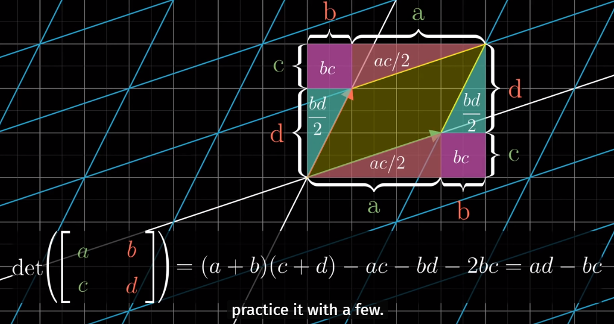

Based on a great series that introduce linear algebra [Essence of linear algebra - 3blue1brown][youtube-linear]. This blog covers [chapter6][youtube-ch6].

# What is Determinant
In 2D spaces, the scaling factor by which a linear transformation changes any *area* (*volume* in 3D...) is called the **determinant** of that transformation.

With some particular transformation, the 2D space would be squished to a line, or even a point. The determinant becomes 0 in such situation. It means that the columns in the matrix are linearly dependent. (see [Linear Algebra[1]][LA-1])

With some other transformation, the space might be "flipped over". That is, if $$\vec{j}$$ was to the left of $$\vec{i}$$ before the transform, after it, $$\vec{j}$$ appears at the right of $$\vec{i}$$. This type of transformation has negative determinant values.

In 3D spaces, the determinant is the scaling factor of any volume. To visually determine whether it's negative, we could use the *right-hand rule*(see [wiki][rh-rule]) for the 3D coordinates. If we can apply that rule both before and after the transformation, the determinant value is positive, otherwise, negative(or zero).

For 2D transformation, the determinant would be $$ad-bc$$. We could illustrate that even with some area calculating.

With this understanding of determinant, we could easily prove $$der(M1M2) = der(M1) \times der(M2)$$.

[youtube-linear]: https://www.youtube.com/playlist?list=PLZHQObOWTQDPD3MizzM2xVFitgF8hE_ab
[youtube-ch6]: https://youtu.be/Ip3X9LOh2dk
[LA-1]: ../../../_posts/Linear-Algebra[1]
[rh-rule]: https://en.wikipedia.org/wiki/Right-hand_rule