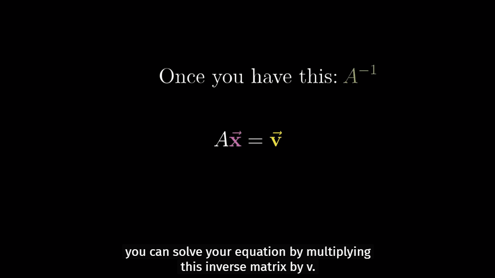

Based on a great series that introduce linear algebra [Essence of linear algebra - 3blue1brown][youtube-linear]. This blog covers [ch7][youtube-ch7].

# Matrices in Solving Equations
By now, you already have a hint for how matrix is used in describing the manipulation of space, which is useful for things like computer graphics and robotics. But one of the main reason that linear algebra is more broadly appicable, and required for just about any technical discipline, is that it lets us solve **linear systems of equations**(see [wiki][wiki-lse]).

We can package all equations together into a single vector equation, where we have the matrix containing all of the constant coefficients, and a vector containing all of the variables, and their matrix vector product equals some different constant vector.

Let's name that constant matrix $$A$$, denote the vector holding the variables with $$\vec{x}$$, and call the constant vector on the right-hand side $$\vec{v}$$. Now we can represent the system of equations with a single line:

$$A \vec{x} = \vec{v}$$

From a geometric prospective, solving the equation $$A \vec{x} = \vec{v}$$, means we're looking for a vector $$\vec{x}$$ which, after applying the transformation, lands on $$\vec{v}$$. We could subdivide into the case where $$A$$ has non-zero determinant, and the case where $$A$$ has zero determinant.

1.  $$der(A)$$ not equals to 0   
    In this (most-likely) case, we could find out the reverse transformation and play it on $$\vec{v}$$. And the reversed transformation corresponds to a matrix, which normally called the **"inverse of $$A$$"**, denoted by $$A^{-1}$$. The result of $$A^{-1} \times A$$, is the matrix that corresponds to doing nothing. The transformation that does nothing is called the **identity transformation**.
   
    Once you find this inverse, which, in practice, you do with a computer, you can solve your equation by multiplying this inverse matrix by $$\vec{v}$$:

    
$$\vec{x} = A^{-1} \vec{v} $$

    And you'll get a unique solution.

    

    For spaces of higher dimension, when the number of equations equals the number of unknowns, it's *almost* certainly the case that there's a single, unique solution, as long as the transformation $$A$$ doesn't squish all of space into a lower dimension (which means, determinant is non-zero). 

2.  $$der(A)$$ equals to 0
    When the transformation associated with this system of equation squishes space into a smaller dimension, there is no inverse. You cannot unsquish a line to turn it into a plane. But still, it's possible that a solution exists. It's just that you have to be lucky enough that the $$\vec{v}$$ lives somewhere in the lower-dimensional space.

    

    You might notice that some of these zero determinant cases feel a lot more restrictive than others. For instance, when you 

   
[youtube-linear]: https://www.youtube.com/playlist?list=PLZHQObOWTQDPD3MizzM2xVFitgF8hE_ab
[youtube-ch7]: https://youtu.be/uQhTuRlWMxw
[wiki-lse]: https://en.wikipedia.org/wiki/System_of_linear_equations